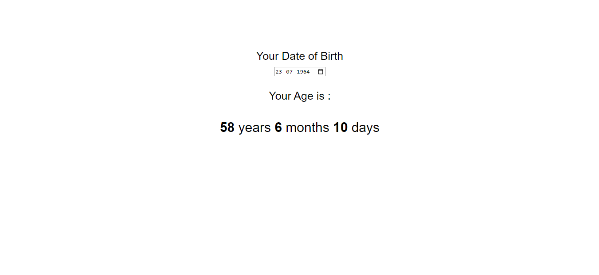
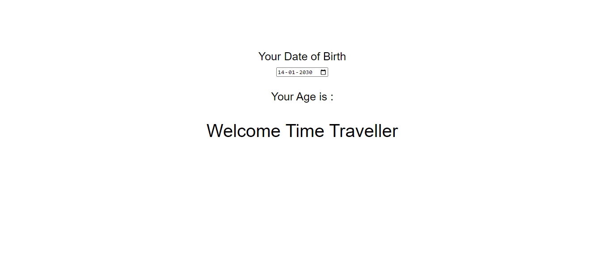

# PRANAV MATHUR

## Learnings from the project:

- Working with the **Date** object
- Separating code into different functions so it becomes more readable

## Time taken:

    It took me 5 hours to complete this project.

## Screenshots:

## Live link:

[Go to site](https://13-age-calculator.netlify.app/)
